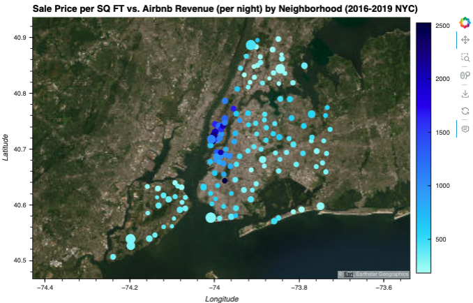
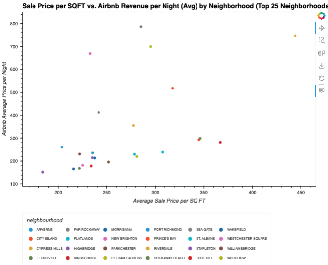
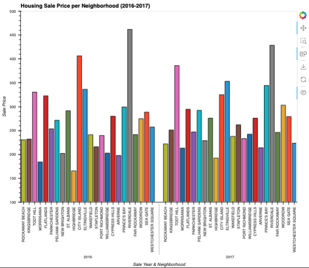
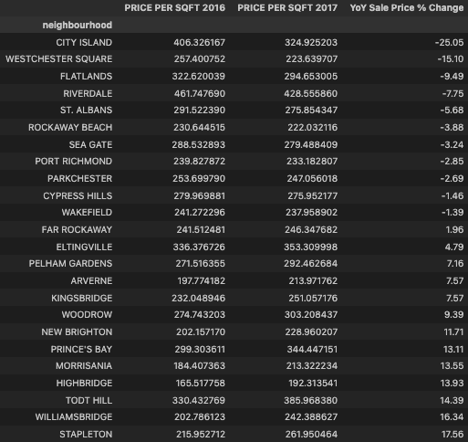
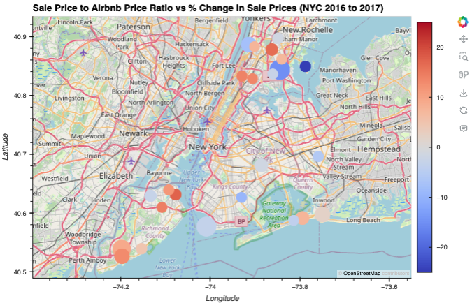
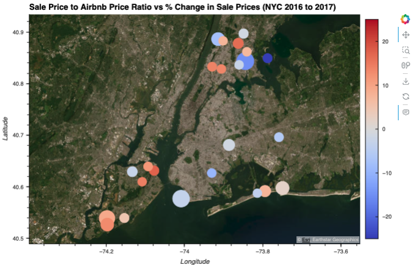

# Project 1: AirBnb Hunters

The goal of this project was to use existing housing and AirBnb data in order to determine the most optimal neighborhoods in New York City to purchase a residential investment property for AirBnb rental purposes.

## Table of Contents

* [General Information](#general-information)
* [Findings](#findings)
* [Software and Technologies Used](#software-and-technologies-used)
* [Use Cases](#use-cases)
* [What If We Had More Time](#what-if-we-had-more-time)
* [Team Information](#team-information)

## General Information

In the current dynamic landscape of real estate and short-term rentals, making an `informed investment decisions` is critical. With the rise of platforms like [Airbnb](http://aribnb.com), property owners of all sorts have the opportunity to tap into the world of short-term rentals for an additional source of income. However, the success of an Airbnb investment hinges on the choice of neighborhood.

This project seeks to address this crucial challenge of helping potential investors find the `most optimal short-term rental neighborhoods`. It aims to do so by leveraging datasets and housing records that have been gathered over the years. Through data-driven analysis, we can `empower investors` to navigate the nuances of property prices and rental demand.

## Findings

It's possible to identify optimal locations for real estate investment in NYC by analyzing AirBnB nightly rental data and NYC sales prices

### Understanding the Individual Datasets

By grouping both, NYC Housing Sales and AirBnb Rental Price, datasets by neighborhood, we were able to identify key neighborhoods individually. Specifically, we were able to identify neighborhoods with the best sales prices as well as neighborhoods in which AirBnb revenue was the highest.

Combining this data and re-plotting (Figure 3 and Figure 4) it allowed us to visualize sale price per square foot compared to AirBnb revenue per square foot in each neighborhood; in turn helping us categorize neighborhoods into different segments based on property prices and potential rental income


*Figure 1: NYC housing sale prices per neighborhood*


*Figure 2: Airbnb price per night by neighborhood*



*Figure 3: Sale price per square foot vs. Airbnb revenue per square foot by neighborhood*


*Figure 4: Scatter plot of sale price vs. Airbnb revenue by neighborhood*

### Top 25 Neighborhoods to Consider

Figure 3 and Figure 4 helped us identify neighborhoods where sale prices were relatively low compared to revenue that could be generated from Airbnb rentals. Using these findings as well as an "Average Sale vs. AirBnb Price Ratio" (seen in Figure 5), we were able to narrow down our full list of neighborhoods to a select 25 that would be further analyzed. These neighborhoods are identified in Figures 5, 6 and 7 and visualized in various forms.

Figure 5, specifically, shows the top 25 neighborhoods sorted by ratio of Average Sale Price vs AirBnb Rental Price:


*Figure 5: List of Top 25 Neighborhoods sorted by average sale price vs. AirBnb rental price ratio*



*Figure 6: Scatter plot of Top 25 Neighborhoods sorted by average sale price vs. AirBnb rental price ratio*



*Figure 7: Top 25 Neighborhoods - Housing Sale Price per Neighborhood in 2016 compared to 2017* 

### Understanding Sale Price Change (Year over Year)

**Where are sale prices falling within NYC neighborhoods?**

City Island (-25%), Westchester Square (-15%), Flatlands (-9.5%), Riverdale (-7.8%), and St. Albans (-5.6%) exhibit the largest decrease in sale price per SQFT YoY from 2016 to 2017

Figure 8 below plots the Top 25 neighborhoods we've selected against each other over 2016 and 2017. From this graph, we're able to identify a general year over year change in sale price per neighborhood.


*Figure 8: Price Per Square Foot view of Housing Sale Price per Neighborhood in 2016 vs. 2017*

The same data is visible in Figure 9; displaying the exact percent change in NYC housing sale price between 2016 and 2017.



*Figure 9: Top 25 Neighborhood Stats showing YoY Calculations*

Looking further into percent change in sale price when compared to the sale price to AirBnb ratio (see Figure 10 and 11), we were able to identify that Westchester Square is the most optimal place to purchase an AirBnb short-term rental property! 



*Figure 10: OSM view of Sale Price to AirBnb Price Ratio vs. Percent Change in Sale Prices (2016-2017)*



*Figure 11: ESRI view of Sale Price to AirBnb Price Ratio vs. Percent Change in Sale Prices (2016-2017)*

### What's available to buy!?

Within the top 25 ideal neighborhoods to purchase, we targeted the neighborhoods with the largest year-over-year price declines. The top 3 largest decliners were City Island, Westchester Square, and Flatlands, with declines of 10% to 25%.

Based on our analysis, Westchester Square was the optimal location to buy a home for AirBnB profitable rentals with a high nightly rental to purchase price ratio and decreasing trend for sale prices to buy a property. Using the Scrapy library and code below (Figure 12), we were able to scrape Homes.com to find the following list of properties to consider buying (Figure 13).


*Figure 12: Snippet of Scrappy Python code used to extract available listings in a specified neighborhood*


*Figure 13: Available listings captured via Scrapy*

## Software and Technologies Used

### Development Environment

* Python Version 3.10.12
* Scrapy 2.10.0
* Git 2.32.0
* Jupyter Notebook 3.6.3
* VS Code 1.80.2

### Libaries

* [Pandas](https://pandas.pydata.org/docs/)
* [Pathlib](https://docs.python.org/3/library/pathlib.html)
* [Numpy](https://numpy.org/doc/stable/)
* [Matplotlib](https://matplotlib.org)
* [hvPlot with Pandas](https://hvplot.holoviz.org)
* [HoloViews](https://holoviews.org)
* [Scrapy](https://docs.scrapy.org)

## Data Clean-Up and Exploration

### Data Collection
To find the best neighborhoods for Airbnb rental investments, we discovered two sets of data that helped guide our analysis

1. [NYC Property Sales](https://www.kaggle.com/datasets/new-york-city/nyc-property-sales) (`nyc-rolling-sales.csv`): A year's worth of properties sold on the NYC real estate market (2016-2017)
2. [NYC AirBnb Open Data](https://www.kaggle.com/datasets/dgomonov/new-york-city-airbnb-open-data) (`AB_NYC_2019.csv`): Airbnb listings and metrics in NYC, NY, USA (2019)

The first set of data, NYC Property Sales, gives insight into NYC housing sales and sale prices. This data was intend to helps us understand the real estate market and figure out which neighborhoods are more expensive and which ones are more affordable to buy properties in.

The second set of data, NYC AirBnb Open Data, contains information about AirBnb nightly costs in each neighborhood. It was intended for us to analyze how much money we might earn by renting out a property on Airbnb in different areas on NYC. 

By using both of these datasets together, we are able to make informed decisions about which neighborhoods in NYC could be the best for our investment.

### Preparing the Data
To ensure the data being used is clean and consistent we:
1. Droped the null values
2. Droped unwanted, noisy columns
3. Calculated critical metrics
    * Average price per squarefoot
    * Average price per AirBnb rental night
    * Sale price to nightly rental rate ratio
    * Percent Change (Year over Year) in sale price between 2016 and 2017
4. Normalized the data
   * In our case, this primarily pertained to neighborhood name data
   * When normalizing the data we had to add a sale price per square foot in order to account for number of rental units in a building as well as size of an apartment

### Creating Consolidated Dataframes
1. Combined NYC housing sales and AirBnb data to create a normalized dataframe
2. Repeated the data clean up processes where necessary

### Analyzing basic data
1. Calculated a metric that compares Cost per Square Foot and Average Nightly Rental Rate for optimal low cost / high return
2. Generated Plots that can be further analyzed
    * Sale price per neighborhood (geoviews)
    * AirBnb rental price per neighborhood (geoviews)
    * Price per sale coupled with nightly AirBnb rate by neighborhood

### Analyzing Top 25 options
1. Narrowed analysis down to top 25 locations in order to have digestible plots and views
2. Plotted data
    * Scatter plot to see correlation of top 25 locations for Sale Price per SQ FT and AirBnB Rental Price per Night by Neighborhood
    * Top 25 neighborhoods average price per SQFT per year (2016 and 2017)
    * Top 25 neighborhoods average price per SQFT showcasing locations that have falling sale prices optimal for cheap purchase
    * Finnal 25 neighborhoods using geoviews to visualize optimal location for investment based on average nightly AirBnB rental price vs percent change in sale price between 2016 and 2017

### Locating available investment properties from homes.com via website scraper
In order to use a new library, we imported Scrapy to do website scraping to find available apartments to buy in optimal location

#### Using Scrapy

1. Go to homes.com and search location
2. Copy URL for new website scraping tool:
3. Run the following code in the terminal. This will output a file containing the retrieved property listing information

```
scrapy crawl single_page_spider -o output.json
```

#### Analyzing our Top Neighborhood

1. Selected ideal location based on analysis (Westchester Square)
2. Scrape `homes.com` to produce a file that contains listing details (

## Use Cases

The primary use case for project would be real-estate investment insight. With such insight, we can help potential investors choose neighborhoods with high potential for Airbnb rental income.

## What if we had more time...?

1. Create an application or dashboard to run analysis based on user input for city
2. Convert the `scrapy` script to automated web search instead of manual entry to allow for more accessible use
3. Implement a calculator to recommend locations based on a potential investor's price range

## Code and Presentation Files
1. [`GitHub Project Repository`](git@github.com:sreyanalla/airbnb-hunters.git)

    `https://git@github.com:sreyanalla/airbnb-hunters.git`
    
2. [`Jupyter Notebook Project Code`](Code/airbnb_hunters_final_code.ipynb)
    
    `Repository/Code/airbnb_hunters_final_code.ipynb`
    
3. [`Project Class Presentation Slides`](airbnb_hunters_final_slides.pdf)

    `Repository/airbnb_hunters_final_slides.pdf`

## Team Information

Group 3 - The Bitcoins

**Team Members**: Dane Kunkel, Todd Meier, Sreya Nalla, Patricia Fuglo