# Project 1: AirBnb Hunters
> The goal of this project was to use existing housing and AirBnb data in order to determine the most optimal neighborhoods in New York City to purchase a residential investment property for AirBnb rental purposes.

## Table of Contents
* [General Info](#general-information)
* [Technologies Used](#technologies-used)
* [Features](#features)
* [Screenshots](#screenshots)
* [Setup](#setup)
* [Usage](#usage)
* [Project Status](#project-status)
* [Room for Improvement](#room-for-improvement)
* [Acknowledgements](#acknowledgements)
* [Contact](#contact)
<!-- * [License](#license) -->

## General Information
- In the current dynamic landscape of real estate and short-term rentals, making an `informed investment decisions` is critical.

- With the rise of platforms like Airbnb, property owners have the opportunity to tap into the world of short-term rentals. However, the success of an Airbnb investment hinges on the choice of neighborhood.

- This project seeks to address this crucial challenge by leveraging datasets and housing records in order to more easily unveil hidden insights within NYC’s real estate market.

- Our project aims to assist potential investors in identifying the most optimal neighborhood for their Airbnb rental investment. Through data-driven analysis, we can empower investors to navigate the nuances of property prices and rental demand.

## Findings
#### It's possible to identify optimal locations for real estate investment in NYC by analyzing AirBnB nightly rental data and NYC sales prices

Where is the optimal location to buy a rental property in NYC based on nightly revenue from an AirBnB?

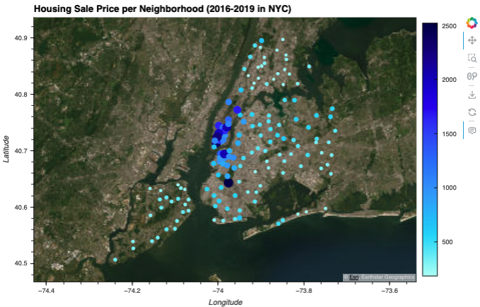
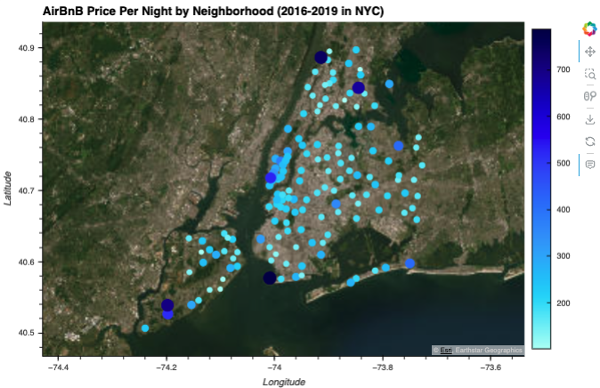
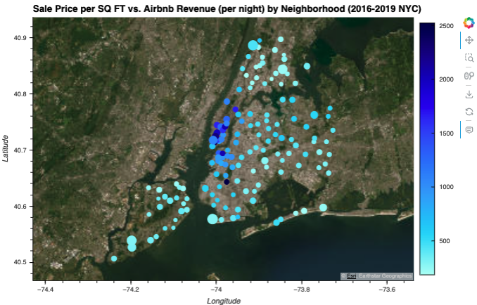
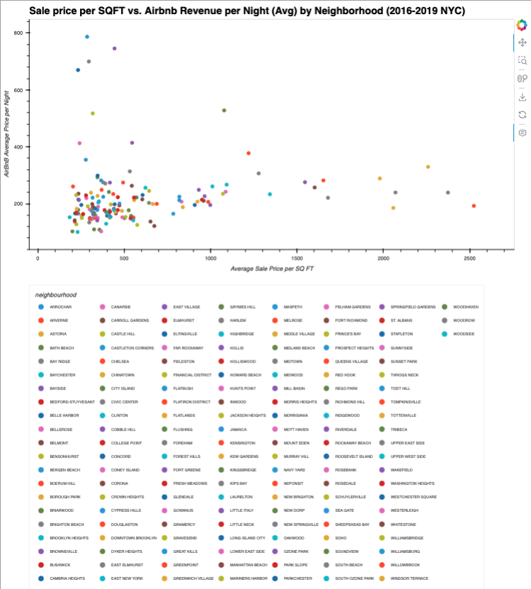

What are the top 25 neighborhoods to consider?

Top 25 neighborhoods sorted by ratio of Average Sale Price vs AirBnb Rental Price:

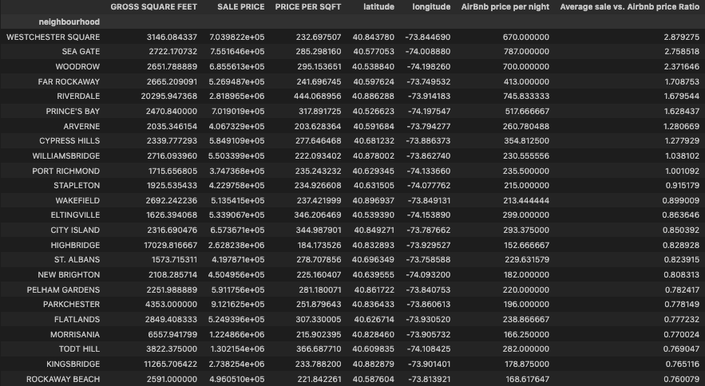

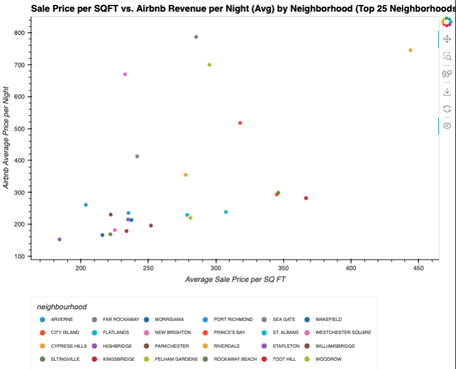

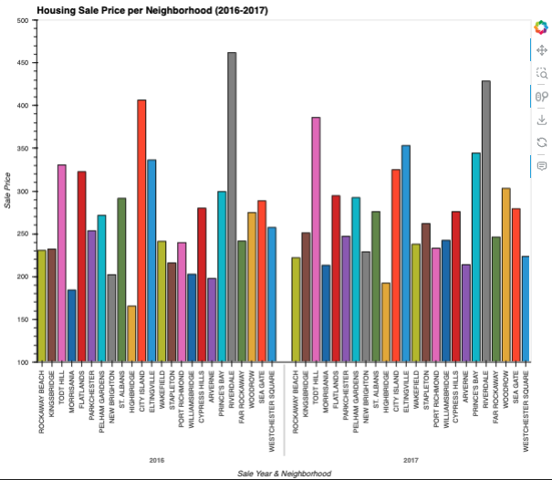

Where are sale prices falling within NYC neighborhoods in order isolate attractive neighborhoods?

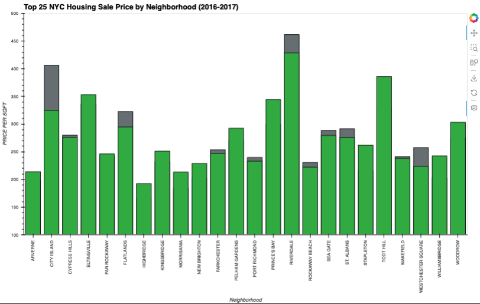

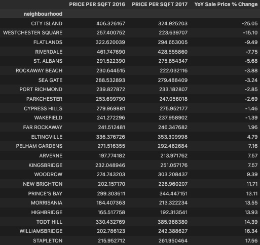
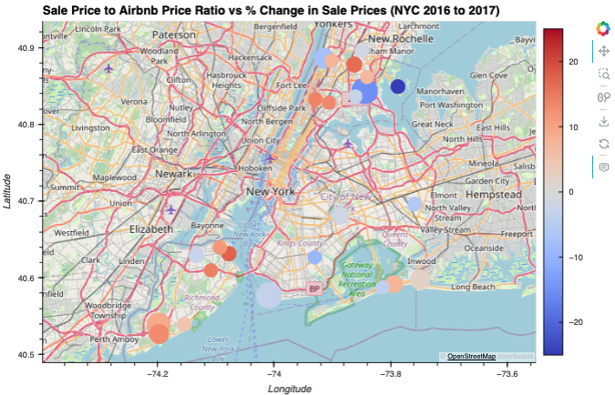
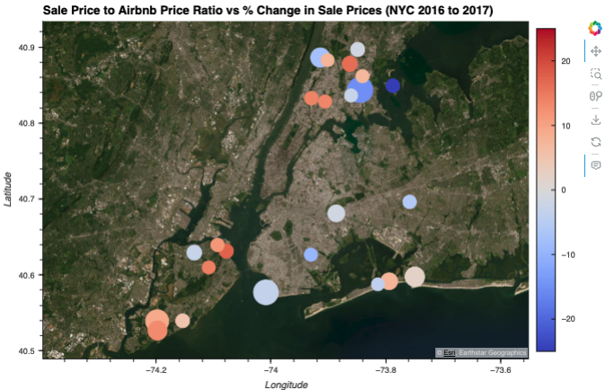

What are available housing units to buy within the ideal neighborhood?

Within the top 25 ideal neighborhoods to purchase, we targeted the neighborhoods with the largest year-over-year price declines.  The top 3 largest decliners were City Island, Westchester Square, and Flatlands, with declines of 10% to 25%.

Based on our analysis, Westchester Square was the optimal location to buy a home for AirBnB profitable rentals with a high nightly rental to purchase price ratio and decreasing trend for sale prices to buy a property.   Using the Scrapy library and code below, we were able to scrape Homes.com to find the following list of properties to consider buying.

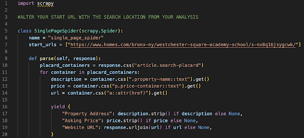
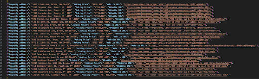

## Technologies and Datasets Used
### Development Environment
- Python Version 3.10.12
- Scrapy 2.10.0
- Git 2.32.0
- Jupyter Notebook 3.6.3
- VS Code 1.80.2
- README Markdown

### Libaries
- pandas
- pathlib import Path https://docs.python.org/3/library/pathlib.html
- numpy  https://numpy.org/doc/stable/
- %matplotlib inline https://matplotlib.org
- hvplot.pandas
- holoviews
- scrapy https://docs.scrapy.org

### Datasets

`nyc-rolling-sales.csv`

A year's worth of properties sold on the NYC real estate market (2016-2017)

https://www.kaggle.com/datasets/new-york-city/nyc-property-sales

`AB_NYC_2019.csv`

Airbnb listings and metrics in NYC, NY, USA (2019)

https://www.kaggle.com/datasets/dgomonov/new-york-city-airbnb-open-data

## Setup
What are the project requirements/dependencies? Where are they listed? A requirements.txt or a Pipfile.lock file perhaps? Where is it located?

Proceed to describe how to install / setup one's local environment / get started with the project.

## Data Clean-Up and Exploration
### 1. Import and Clean Data

Drop nulls  (lots of nulls)
Drop unwanted columns (lots of unnecessary data for analysis)
Normalize data
Calculate metrics needed:

Average Price per SQ FT
Average price per AirBnB rental night
Sale Price to Nightly Rental Rate Ratio
% change YoY in sale price for 2016 to 2017

Combine dataframes

Normalize neighborhood names
- When normalizing the data we had to add a sale price per square foot in order to account for number of rental units in a building as well as size of an apartment
Create dataframes for each plot use case

### 2. Analyze basic data
- We calculated a metric that compares Cost per Square Foot and Average Nightly Rental Rate for optimal low cost / high return
1. Plot sale price per neighborhood (geoviews)
2. Plot airbnb rental price per neighborhood (geoviews)
3. Price per sale coupled with nightly AirBnB rate - by neighborhood (per night)
### 3. Analyze Top 25 options
4. Narrowed analysis down to top 25 locations in order to have digestible plots and views
5. Plot a scatter to see correlation of top 25 locations for Sale Price per SQ FT and AirBnB Rental Price per Night by Neighborhood
6. Plot top 25 neighborhood average price per SQFT per year (2016 and 2017)
7. Plot top 25 neighborhoods average price per SQFT showcasing locations that have falling sale prices optimal for cheap purchase
8. Plot final 25 neighborhoods with geoviews to see optimal location for investment based on average nightly AirBnB rental price vs % change in sale price between 2016 and 2017
## Locate available investment properties from homes.com via website scraper
- In order to use a new library, we imported Scrapy to do website scraping to find available apartments to buy in optimal location

Within Scrapy - go to homes.com and search location, copy URL for new website scraping tool:
RUN THIS CODE IN TERMINAL WITHIN YOUR SCRAPY FOLDER: scrapy crawl single_page_spider -o output.json
THIS WILL OUTPUT FILE CONTAINING LISTING INFO
1. Select ideal location based on analysis - Westchester Square
2. Scrape homes.com and produce a file that contains listing details (edite
d) 

## Usage
### Use Cases
Provide various use cases and code examples here.

### How-To

## Project Status
Project is: _complete

## Room for Improvement
Include areas you believe need improvement / could be improved. Also add TODOs for future development.

Room for improvement:
- Improvement to be done 1
- Improvement to be done 2

To do:
- Feature to be added 1
- Feature to be added 2

## Acknowledgements
Give credit here.
- This project was inspired by...
- This project was based on [this tutorial](https://www.example.com).
- Many thanks to...

## Contact
Created by [@flynerdpl](https://www.flynerd.pl/) - feel free to contact me!

<!-- Optional -->
<!-- ## License -->
<!-- This project is open source and available under the [... License](). -->

<!-- You don't have to include all sections - just the one's relevant to your project -->
